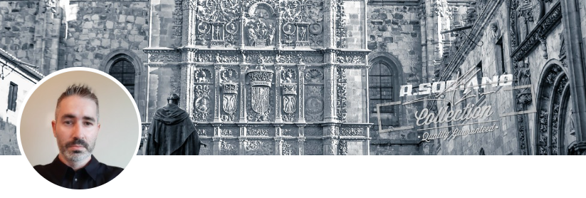

### Hi there 👋

# Raúl Soriano Bravo Professional Account
> Pojects developed by me as enterprise employee
> Visit my profesional profile in [_here_](https://www.linkedin.com/in/ra%C3%BAl-soriano-bravo-5381222b/).
> <!-- If you have the project hosted somewhere, include the link here. -->

>GitHub Personal Account in [_here_](https://github.com/raulsorianobravo).

## Table of Contents
* [General Info](#general-information)
* [Technologies Used](#technologies-used)
* [Features](#features)
* [Screenshots](#screenshots)
* [Setup](#setup)
* [Usage](#usage)
* [Project Status](#project-status)
* [Room for Improvement](#room-for-improvement)
* [Acknowledgements](#acknowledgements)
* [Contact](#contact)
<!-- * [License](#license) -->

## General Information
<!--
- Provide general information about your project here.
- What problem does it (intend to) solve?
- What is the purpose of your project?
- Why did you undertake it?
-->
<!-- You don't have to answer all the questions - just the ones relevant to your project. -->

## Technologies Used
- .NET
- Java
- Python
- Android/iOS

## Features
List the ready features here:
- Awesome feature 1
- Awesome feature 2
- Awesome feature 3

## Screenshots
<!--  -->
<!-- If you have screenshots you'd like to share, include them here. -->

## Setup
<!--What are the project requirements/dependencies? Where are they listed? A requirements.txt or a Pipfile.lock file perhaps? Where is it located?

Proceed to describe how to install / setup one's local environment / get started with the project.
-->

## Usage
<!--How does one go about using it?
Provide various use cases and code examples here.

`write-your-code-here`
-->

## Projects Status
<!--Project is: _in progress_ / _complete_ / _no longer being worked on_. If you are no longer working on it, provide reasons why.-->

## Room for Improvement
<!--
Include areas you believe need improvement / could be improved. Also add TODOs for future development.

Room for improvement:
- Improvement to be done 1
- Improvement to be done 2

To do:
- Feature to be added 1
- Feature to be added 2
-->

## Acknowledgements
<!--Give credit here. -->
<!-- - This project was inspired by... -->
<!-- - This project was based on [this tutorial](https://www.example.com). -->
<!-- - Many thanks to... -->

## Contact
Created by [Me](raul.soriano@nunegal.com) - feel free to contact us!

<!-- Optional -->
<!-- ## License -->
<!-- This project is open source and available under the [... License](). -->

<!-- You don't have to include all sections - just the one's relevant to your project -->

<!--
**rsorianobravo/rsorianobravo** is a ✨ _special_ ✨ repository because its `README.md` (this file) appears on your GitHub profile.

Here are some ideas to get you started:

- 🔭 I’m currently working on ...
- 🌱 I’m currently learning ...
- 👯 I’m looking to collaborate on ...
- 🤔 I’m looking for help with ...
- 💬 Ask me about ...
- 📫 How to reach me: ...
- 😄 Pronouns: ...
- ⚡ Fun fact: ...
-->
